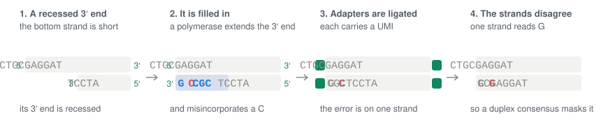

# chaff

[](http://bioconda.github.io/recipes/chaff/README.html)
[](http://bioconda.github.io/recipes/chaff/README.html)
[](https://github.com/clintval/chaff/actions/workflows/ci.yml?query=branch%3Amain)
[](https://coveralls.io/github/clintval/chaff?branch=main)
[](LICENSE)
[](https://www.rust-lang.org/)

Flag somatic variant calls that are library-preparation artifacts.

Install with mamba, conda, or run directly with pixi:

```bash
pixi exec \
    -c conda-forge -c bioconda \
    chaff --help
```

## Quick Start

The tool `chaff` takes a VCF of somatic calls, the BAM they were called from, and the reference FASTA, which needs a `.fai`.
The examples run from a clone of this repository on the test data of fgbio's `FilterSomaticVcf` [[6]](#references), plain read pairs rather than a duplex consensus BAM.
Score the calls for *copied damage*, a lesion copied onto both strands before the UMI-bearing adapters were ligated, and filter likely copies; on a Duplex Sequencing library, this is the only filter to give a threshold:

```console
chaff \
    --input tests/data/calls.vcf \
    --bam tests/data/tumor.bam \
    --ref tests/data/ref.fa \
    --sample tumor \
    --filters copied-damage \
    --copied-damage-threshold 0.05 \
    --metrics tumor.chaff.tsv \
    --output calls.chaff.vcf.gz
```

The annotated calls go to `calls.chaff.vcf.gz`, likely copied damage given a FILTER, and the per-sample metrics to `tumor.chaff.tsv`:

```console
gzip -dc calls.chaff.vcf.gz | grep -v '^#' | cut -f 2,4,5,7,8 | column -t
```

```text
100  C    A  CopiedDamageArtifact  CDAP=0.022;CDLR=1.577;CDAC=3,3;CDRC=72,240
200  G    A  .                     CDAP=1;CDLR=-4.55;CDAC=6,20;CDRC=72,240
300  AAA  A  .                     .
400  A    T  .                     .
500  C    G  .                     .
```

Each scored call's `CDAP` is the posterior probability that it is a real mutation, not that it is an artifact, so a low value marks likely copied damage.
The call at position 100, a C>A that copied damage reads as an oxidized G on the reverse strand, has a `CDAP` of 0.022, at or below the threshold of 0.05, and so the FILTER: all 3 of its alternate molecules sit within 23 bp of that strand's 5′ end (`CDAC=3,3`), against 72 of its 240 reference molecules (`CDRC=72,240`).

## How DNA Damage Becomes a Variant Call

A *template* is one DNA fragment as its two mates, reads or consensus, hold it, counted as one *molecule*, and its *template ends* are its outermost bases, the 5′ ends of its two strands.
A *lesion* is a damaged base on one strand that a polymerase copies as another base:

- **5-methylcytosine deaminates to thymine**, so a methylated CpG reads C>T.
- **Cytosine deaminates to uracil**, so any C can read C>T. Proofreading polymerases of the Pfu family stall at template uracil and often leave it uncopied, so most deamination that survives such a PCR is 5-methylcytosine at CpG; copied damage learns CpG and other contexts apart.
- **Guanine oxidizes to 8-oxoguanine**, which pairs with A, so a G reads G>T, a C>A on the other strand.

Duplex Sequencing [[2]](#references) ligates UMI-bearing adapters to both ends of each fragment and keeps a base only where its two strands agree.
A duplex consensus therefore removes an error on one strand, such as a lesion left uncopied, but not damage copied onto both strands before the adapters were ligated.
End repair's polymerase does that copying before the adapters are ligated: it extends each recessed 3′ end across the 5′ overhang opposite it, and, where it displaces strands, from a nick, and copies a lesion it passes onto the partner strand, so copied damage reads as a real change on both strands.

## The Filters

Each filter compares where a call's alternate molecules sit on their templates with where the reference molecules sit, then writes the posterior probability that the call is real, given the sample's *artifact fraction*, the share of its calls that are the artifact, learned from all of them.
Under `--model fgbio`, which only reproduces fgbio's values, each call's artifact fraction comes from its own alternate allele fraction instead.
A low posterior marks a likely artifact, and a threshold filters calls at or below it.
Each filter models one library-preparation step that leaves an artifact near a known end of the fragment:


The length a polymerase fills in varies from fragment to fragment, so the evidence for copied damage and end repair fill-in fades with distance from the end, by an exponential *decay* whose *scale*, the mean fill-in length, is learned per sample, while A-tailing changes only the last base of a 3′ end and is scored within a 2 bp window.
The filters score SNVs whose genotype is heterozygous, or missing as many somatic callers write it; homozygous, haploid, and indel calls pass unscored, since the filters weigh alternate molecules against the sample's reference molecules at the site.
Copied damage scores the SNVs in its damage classes on either strand: C>T covers C>T and G>A calls, and G>T covers G>T and C>A calls.
A-tailing scores those whose alternate base is A or T, and end repair fill-in all of them.

### Copied Damage


Copied damage carries its change on both strands, so the duplex consensus agrees on it, which makes this the filter for Duplex Sequencing.
Fragmenting with a restriction enzyme that leaves blunt ends, as NanoSeq does [[3]](#references), or repairing lesions before end repair, as Duplex-Repair does [[4]](#references), keeps lesions from being copied.

- **Measured from:** the 5′ end of the *lesion strand*, the strand that carries the damaged base.
- **Scored with:** a decay whose scale is learned per sample, from a default of 30 bp.
- **Writes:** the posterior `CDAP`, the likelihood ratio `CDLR`, the molecule counts `CDAC` and `CDRC`, and the FILTER `CopiedDamageArtifact`.
- **Use it when:** UMI-bearing adapters are ligated after any polymerase fills in ends, nicks, or gaps, as in Duplex Sequencing; it needs the reference, `--ref`.

As the copied damage diagram shows, the copy runs from the partner's recessed end toward the lesion strand's 5′ end, so copied lesions sit near that end, while a real mutation's molecules sit wherever the reference molecules do.

Copied damage has one blind spot: a lesion copied from an internal nick, by nick translation or strand displacement, or across the gap an abasic site leaves, can sit anywhere in the template, so its alternate molecules carry no signal of an end, and they show only as an excess of the damage class across a library.

A duplex consensus BAM that carries each strand's single-strand consensus, the `ac`, `bc`, `ad` and `bd` tags fgbio and fgumi write, covers it.
The tool then reads every molecule once more, counting its duplex changes and its *single-strand* changes, lesions on one strand that no polymerase copied, per damage class and context.
Copied lesions land on a position one molecule at a time, while a real mutation in a clone puts several molecules on one position, so the artifact fraction a call with two or more alternate molecules starts from becomes the share of the library's positions as deep with as many changes that chance explains, unless `--copied-damage-prior learned` keeps the learned one or the call looks germline, alternate in 20% of its molecules.
Two real mutations on single molecules at one position read as chance too, so where real mutations on one molecule come at a tenth of the damage rate or more, the chance share costs real calls on two molecules, and a position damaged far beyond the rest of its class looks real to it, so a threshold there rests on the decay alone.
Without those tags, the artifact fraction is learned from the calls.

### End Repair Fill-In



End repair's polymerase can misincorporate a base as it fills in a recessed 3′ end, or copy a lesion in the overhang, and in reads or simplex consensus either change sits on the strand it extended, near that strand's 3′ end.
A misincorporation is on that strand alone, so a duplex consensus removes it, while a copied lesion is on both strands, which is copied damage.
A call near an end can be flagged by both filters, as the call at position 100 is below; for a Duplex Sequencing library, trust copied damage, since the duplex consensus has already removed end repair's errors on one strand.

- **Measured from:** the 3′ end of the strand read 1 reports, which end repair extended: the higher-coordinate end of an F1R2 pair, whose read 1 is forward, and the lower-coordinate end of an F2R1 pair.
- **Scored with:** a decay whose scale is learned per sample, from a default of 15 bp.
- **Writes:** the posterior `ERFAP` and the FILTER `EndRepairFillInArtifact`.
- **Use it when:** a polymerase end-repaired the library before adapter ligation, as in most ligation preps after mechanical or enzymatic fragmentation, and its BAM is not a duplex consensus.

### A-Tailing


A-tailing adds a non-templated A to each 3′ end, for adapters with a T overhang to be ligated to.
Where end repair over-digested a 3′ end by one base, that A stands in for the lost base on that strand alone, which a duplex consensus mostly removes, and reads as an A near the template's higher-coordinate end when it is the forward strand and as a T near its lower-coordinate end when it is the reverse.

- **Measured from:** the template end where the added A reads, the lower-coordinate end for a T and the higher-coordinate end for an A.
- **Scored with:** a 2 bp window, as in fgbio, since the artifact changes only the last base of a 3′ end.
- **Writes:** the posterior `ATAP` and the FILTER `ATailingArtifact`.
- **Use it when:** the library was A-tailed for T-overhang adapters, unlike blunt-end ligation or transposase (tagmentation) preps, and its BAM is not a duplex consensus.

> [!NOTE]
> Where read trimming leaves the A-tail in place, the non-templated A can show on both strands, so a duplex consensus does not always remove it: it stays at the last base of a 3′ end.
> Before dropping A-tailing for a Duplex Sequencing library, measure it as in [2. Measure](#2-measure): a small `asymmetry_p_value` in its rows of the metrics says the library has the artifact.

## Setting and Tuning

Every filter runs by default and only annotates calls until given a threshold, so choosing a filter means giving it a threshold.
Start from each filter's **Use it when** line, then let the data confirm the choice: give a filter a threshold when somatic calls show an excess of C>T or C>A with few supporting molecules, when their alternate bases crowd one fragment end, or when the filter's metrics, below, show a small asymmetry p-value.
Suspect copied damage in old, stored, or degraded specimens, and when C>T at CpG exceeds what the matched normal or the clock-like signature SBS1 predicts.

### 1. Look

Profile the raw reads, before consensus, with the `error` tool of [Riker](https://github.com/fulcrumgenomics/riker), as `riker error -i raw.bam -r ref.fa -o raw --stratify-by ref_base,read_base,read_num,cycle`, whose `raw.error-mismatch.txt` gives each substitution's `frac_error` by read number and cycle, in sequencing orientation, in rows such as `C,T,R1,1` for read 1's C>T at cycle 1.
A C>T rate rising toward cycle 1 is deamination in single-stranded 5′ overhangs [[1]](#references), the lesions end repair copies; a C>A excess on one read number and not the other is 8-oxoguanine, the read-orientation bias that GATK's `LearnReadOrientationModel` [[5]](#references) models; and an A or T excess at read ends is A-tailing.
How far from read starts an excess reaches is a check on the decay scales the tool learns.
Damage copied onto both strands before the adapters were ligated looks the same on both strands, so no strand or read-number metric separates it from a real variant, and only the next step can see it.

### 2. Measure

Run the filters without thresholds, so they annotate the calls without filtering them, and write the metrics and the spectrum; each stratum's artifact fraction is learned from every scored call, whatever its FILTER, so first drop calls your caller rejected:

```console
chaff \
    --input tests/data/calls.vcf \
    --bam tests/data/tumor.bam \
    --ref tests/data/ref.fa \
    --sample tumor \
    --output calls.annotated.vcf.gz \
    --metrics tumor.chaff.tsv \
    --spectrum tumor.spectrum.pdf
```

In the spectrum, compare the expected real SNVs with every SNV: copied damage shows as C>T at CpG, or C>A, that shrinks when weighted while the other channels keep their height.

Each row of the metrics describes one filter and *stratum*, a group of calls that share an artifact rate: the damage class and CpG context for copied damage, and the substitution for the others; its columns are:

- **Calls:** `calls`, the calls scored, and `filtered`, the calls given the FILTER.
- **Fractions:** `artifact_fraction`, the stratum's learned share of artifacts, which stays near `filter_artifact_fraction`, the filter's over all its strata, until the stratum has many calls; `expected_artifacts` and `expected_mutations`, each call's chance of being either summed, a call without a posterior counting as real.
- **Distance:** `distance`, the decay scale or window in bases.
- **Molecules:** `alt_molecules` and `ref_molecules`, the molecules measured, and their `_congruent` counts and fractions, those within the distance of the artifact's end.
- **Asymmetry:** `expected_alt_congruent`, the alternate molecules each call's own reference molecules predict within the distance, and `asymmetry_p_value`, a one-sided test of whether more sit there; a small value says the library has the artifact.
- **Single strand:** for copied damage on a BAM with single-strand consensus, `change_rate` and `single_strand_rate`, the duplex and single-strand changes of the class per molecule over positions of more than 10 molecules, their `conversion_ratio`, `chance_fraction`, the mean prior of its calls, and `chance_excess`, the positions with two or more changes that chance expects beyond those seen and their noise, as a share of them, zero when the model fits.

```console
cut -f 2,3,6,8,18 tumor.chaff.tsv | column -t
```

```text
filter              stratum      artifact_fraction  distance  asymmetry_p_value
copied-damage       C>T:non-CpG  0.44854            23.0591   0.589947
copied-damage       G>T:CpG      0.537421           23.0591   0.0274487
a-tailing           C>A          0.19272            2.0       0.00246167
a-tailing           C>T          0.189318           2.0       1.0
a-tailing           T>A          0.189332           2.0       0.000231639
end-repair-fill-in  C>A          0.391688           12.1865   0.00451579
end-repair-fill-in  C>G          0.301492           12.1865   1.0
end-repair-fill-in  C>T          0.301492           12.1865   0.665409
end-repair-fill-in  T>A          0.301492           12.1865   1.0
```

With one call per stratum, each stratum's fraction stays near its filter's, learned from only 2 to 4 calls, so the fractions say little here; the p-values carry the signal, small for copied damage's G>T:CpG, A-tailing's C>A and T>A, and end repair fill-in's C>A.
The scales, 23.1 bp from 2 copied-damage calls and 12.2 bp from 4 end repair calls, sit between the defaults of 30 and 15 bp and the 3 bp from the end within which the call at position 100 has all its alternate molecules, and the counts behind a p-value are in its row:

```console
grep -e ^sample -e a-tailing tumor.chaff.tsv | cut -f 3,11,12,13,18 | column -t
```

```text
stratum  alt_molecules  alt_congruent  expected_alt_congruent  asymmetry_p_value
C>A      3              2              0.0867769               0.00246167
C>T      20             0              0.578512                1.0
T>A      5              3              0.144628                0.000231639
```

Three of the 5 alternate molecules of the A>T at position 400 sit where A-tailing puts them, against 0.14 expected, yet the other 2 cannot be A-tailing, so the call is spared: the p-value asks whether a library has the artifact, and the posterior whether one call is it.

### 3. Set and Check

A threshold of 0.05 filters the calls with at most a 5% chance of being real.
Here each filter applies its FILTER at 0.05, which suits these plain read pairs, and the output is BGZF-compressed by its extension:

```console
chaff \
    --input tests/data/calls.vcf \
    --bam tests/data/tumor.bam \
    --ref tests/data/ref.fa \
    --sample tumor \
    --output calls.chaff.vcf.gz \
    --copied-damage-threshold 0.05 \
    --end-repair-fill-in-threshold 0.05 \
    --a-tailing-threshold 0.05
gzip -dc calls.chaff.vcf.gz | grep -v '^#' | cut -f 2,4,5,7 | column -t
```

```text
100  C    A  CopiedDamageArtifact;EndRepairFillInArtifact
200  G    A  .
300  AAA  A  .
400  A    T  .
500  C    G  .
```

The call at position 100 is filtered as copied damage and end repair fill-in, and the deletion at position 300 is not scored.
The calls at positions 400 and 500 pass: their alternate molecules sit at the 5′ end of the strand read 1 reports, where end repair adds no bases, and 2 of the A>T's 5 alternate molecules sit where A-tailing cannot put them.

To check what a threshold costs, add to the run a few germline heterozygous SNVs of the same sample in the stratum it filters, such as C>T at CpG for copied damage, down-sampled to the alternate-molecule counts of your somatic calls and few enough that the stratum's `artifact_fraction` barely moves, compare the metrics with and without them, and count how many the threshold filters.
Where a matched normal or a replicate library exists, the somatic calls it shares are a second check.

### Mutation Burden

A threshold decides each call, and at 2 alternate molecules it catches only a minority of copied damage, so for a mutation burden or frequency, weight each call by its `CDAP` instead, as the `expected_mutations` column of the metrics does.
Summed over the copied damage strata of the run above, it counts the sample's expected real calls:

```console
awk -F'\t' '$2 == "copied-damage" { print $3, $10; n += $10 } END { print "total", n }' \
    tumor.chaff.tsv | column -t
```

```text
C>T:non-CpG  0.999977
G>T:CpG      0.0222778
total        1.02225
```

Of the 2 copied-damage calls, the G>A at position 200 counts as real and the C>A at position 100 as almost surely not.

## How Well It Works

The figures come from a simulated duplex sample, which `tests/figures.py` makes and scores, with:

- 6,000 real mutations across all channels, and 2,000 copied-damage calls at CpG C>T;
- a quarter of each with 2, 3, 5, or 10 alternate molecules, among about 400 duplex molecules per site, on fragments of median length 200 bp;
- fill-in that copies 80% of lesions from the lesion strand's 5′ end, over an exponential length with a mean of 30 bp, and the rest from nicks anywhere in the template.

The tool learns a scale of 42.0 bp, longer than the 30 bp mean since the fifth copied from nicks sits anywhere, and 66% of the copied damage's alternate molecules sit within it, against 23% of the real mutations' and of the reference molecules:


A threshold of 0.05 filters 821 of the 2,000 copied-damage calls and 9 of the 1,065 real C>T at CpG, and none of the 4,935 calls in other channels: 73% of the copied damage with 10 alternate molecules, 50% with 5, 34% with 3, and only 6% with 2.
In the figure, each curve sweeps the threshold over the real C>T at CpG, the stratum copied damage shares, with filled dots at 0.05.
The open circles show `--model fgbio`, which at 0.05 filters 1,955 of the copied-damage calls but also 94%, 75%, 49%, and 11% of the real C>T at CpG with 2, 3, 5, and 10 alternate molecules, against at most 1.6% under `--model chaff`:


On simulated libraries of 400 C>T calls at CpG, most with 2 to 4 alternate molecules, weighting by `CDAP` brings a 2.5-fold overcount at 60% damage down to 1.2-fold, where a threshold of 0.05 leaves 2.2-fold:


Weighting cannot remove the overcount where calls rest on 2 molecules and few of them sit near an end: there the learned artifact fraction understates damage, 51% for a true 60% here, and real data can be less kind.
Calls are real somewhat less often than their `CDAP` says under `--model chaff`, and far more often under `--model fgbio`, while the learned artifact fraction and the asymmetry p-value still rank samples by damage, which makes them a good per-sample covariate:


## What `chaff` Writes

Each filter writes its posteriors and counts into the INFO of the calls it scores, and its FILTER onto the calls at or below its threshold:

| Name&nbsp;&nbsp;&nbsp;&nbsp;&nbsp;&nbsp;&nbsp;&nbsp;&nbsp;&nbsp;&nbsp;&nbsp;&nbsp;&nbsp;&nbsp;&nbsp;&nbsp;&nbsp;&nbsp;&nbsp;&nbsp;&nbsp;&nbsp;&nbsp;&nbsp;&nbsp;&nbsp;&nbsp;&nbsp;&nbsp;&nbsp;&nbsp;&nbsp;&nbsp;&nbsp;&nbsp;&nbsp;&nbsp;&nbsp;&nbsp;&nbsp;&nbsp;&nbsp;&nbsp;&nbsp;&nbsp; | Stands for | Meaning |
| --- | --- | --- |
| `CDAP` | Copied Damage Artifact Posterior | The posterior probability that the call is a real mutation rather than damage copied onto both strands; a low value means likely copied damage. |
| `CDLR` | Copied Damage Likelihood Ratio | The log10 likelihood ratio of copied damage to a real mutation; a high value favors copied damage. |
| `CDAC` | Copied Damage Alternate Counts | The alternate molecules within the decay scale of the lesion strand's 5′ end, and all alternate molecules measured. |
| `CDRC` | Copied Damage Reference Counts | The same two counts for the reference molecules. |
| `ERFAP` | End Repair Fill-in Artifact Posterior | The posterior probability that the call is a real mutation rather than an end repair fill-in error; a low value means a likely error. |
| `ATAP` | A-Tailing Artifact Posterior | The posterior probability that the call is a real mutation rather than an A-tailing artifact; a low value means a likely artifact. |
| `CopiedDamageArtifact` | A FILTER | Applied where `CDAP` is at or below the copied damage threshold. |
| `EndRepairFillInArtifact` | A FILTER | Applied where `ERFAP` is at or below the end repair fill-in threshold. |
| `ATailingArtifact` | A FILTER | Applied where `ATAP` is at or below the A-tailing threshold. |

The tool learns per sample how common each artifact is and how far it reaches, so most runs need only the filters and a threshold, and the model behind the posteriors is described in the crate documentation, in [`src/lib/mod.rs`](src/lib/mod.rs).

## Options

| Option&nbsp;&nbsp;&nbsp;&nbsp;&nbsp;&nbsp;&nbsp;&nbsp;&nbsp;&nbsp;&nbsp;&nbsp;&nbsp;&nbsp;&nbsp;&nbsp;&nbsp;&nbsp;&nbsp;&nbsp;&nbsp;&nbsp;&nbsp;&nbsp;&nbsp;&nbsp;&nbsp;&nbsp;&nbsp;&nbsp;&nbsp;&nbsp;&nbsp;&nbsp;&nbsp;&nbsp;&nbsp;&nbsp;&nbsp;&nbsp;&nbsp;&nbsp;&nbsp;&nbsp;&nbsp;&nbsp;&nbsp;&nbsp;&nbsp;&nbsp;&nbsp;&nbsp;&nbsp;&nbsp;&nbsp;&nbsp;&nbsp;&nbsp;&nbsp;&nbsp;&nbsp;&nbsp; | Sets |
| --- | --- |
| `--input` | The coordinate-sorted VCF or BCF of somatic calls (short `-i`; required). |
| `--output` | The output VCF or BCF, its format set by its extension: `.vcf`, `.vcf.gz`, `.bcf`, or `-` for standard output (short `-o`; required). |
| `--bam` | The coordinate-sorted BAM of the sample, reads or consensus (short `-b`; required). |
| `--ref` | The reference FASTA, with its `.fai`, which copied damage and `--spectrum` need (short `-r`). |
| `--sample` | The sample the BAM holds, required when the VCF has more than one (short `-s`). |
| `--metrics` | The per-sample metrics TSV, one row per filter and stratum (default none). |
| `--spectrum` | A PDF of the sample's heterozygous SNVs by trinucleotide context, whatever their FILTER, in panels on one scale: every SNV, the expected real SNVs, each weighted by the product of its posteriors, and, with a threshold, the SNVs that pass (default none). |
| `--filters` | The filters to run, comma-separated, from `copied-damage`, `end-repair-fill-in`, and `a-tailing` (default `copied-damage,a-tailing,end-repair-fill-in`). |
| `--model` | The model, either `chaff`, which learns each sample's artifact fractions and decay scales, or `fgbio`, which sets each call's artifact fraction from its alternate allele fraction and uses fgbio's windows, to reproduce its values (default `chaff`). |
| `--copied-damage-threshold` | The posterior at or below which copied damage applies its FILTER (default none). |
| `--end-repair-fill-in-threshold` | The posterior at or below which end repair fill-in applies its FILTER (default none). |
| `--a-tailing-threshold` | The posterior at or below which A-tailing applies its FILTER (default none). |
| `--copied-damage-classes` | The damage classes, damaged base `>` read base: `C>T` for deamination from heat, storage, or formalin, and `G>T` for oxidation from shearing or heat (default `C>T,G>T`). |
| `--copied-damage-distance` | The decay scale in bases from the lesion strand's 5′ end, the mean length over which a polymerase copies a lesion strand onto its partner, or `learned` (default `learned`). |
| `--copied-damage-prior` | Where copied damage takes each call's artifact fraction from under `--model chaff`: `chance`, on a BAM with single-strand consensus, the share of the library's positions as deep with as many changes that chance explains, or `learned`, the fraction learned from the calls (default `chance`). |
| `--end-repair-fill-in-distance` | The decay scale in bases from the 3′ end of the strand read 1 reports, or `learned` (default `learned`); under `--model fgbio`, the window from the nearest template end (default 15). |
| `--a-tailing-distance` | The window from the template end, in bases (default 2). |
| `--min-mapping-quality` | The mapping quality floor of a read or consensus (short `-m`; default 20). |
| `--min-base-quality` | The base quality floor at the call (short `-q`; default 20). |
| `--paired-reads-only` | Keep only reads or consensus whose mate is mapped (short `-p`; default off). |

The VCF/BCF and the BAM must be coordinate sorted, with their contigs in the same order, and need no index; the FASTA needs a `.fai`.
Each template counts once, and a read or consensus whose mate maps to the same contig needs the mate's CIGAR in its `MC` tag.
Both ends of a template are measured for an FR pair, whose forward mate starts at or before its reverse mate's 5′ end; a mate of any other pair knows only its own end.
An option of a filter that `--filters` leaves out is a usage error, and so are `--ref` without `copied-damage` or `--spectrum` and `--copied-damage-prior` under `--model fgbio`.
A VCF that already declares an enabled filter's INFO or FILTER, from an earlier run, is refused, so a FILTER never outlives the run that applied it; remove them first, as with `bcftools annotate -x`.

## Development and Testing

See the [contributing guide](./CONTRIBUTING.md) for more information.

## References

The tool `chaff` ports the end repair fill-in and A-tailing filters of fgbio's `FilterSomaticVcf` [[6]](#references), with their likelihoods, tests, INFO keys, and FILTER names, so `--model fgbio` reproduces its values, and adds copied damage, building on these papers and tools:

1. Briggs AW, et al. 2007. Patterns of damage in genomic DNA sequences from a Neandertal. *Proceedings of the National Academy of Sciences* 104(37):14616–14621. [https://doi.org/10.1073/pnas.0704665104](https://doi.org/10.1073/pnas.0704665104)
2. Schmitt MW, et al. 2012. Detection of ultra-rare mutations by next-generation sequencing. *Proceedings of the National Academy of Sciences* 109(36):14508–14513. [https://doi.org/10.1073/pnas.1208715109](https://doi.org/10.1073/pnas.1208715109)
3. Abascal F, et al. 2021. Somatic mutation landscapes at single-molecule resolution. *Nature* 593(7859):405–410. [https://doi.org/10.1038/s41586-021-03477-4](https://doi.org/10.1038/s41586-021-03477-4)
4. Xiong K, et al. 2022. Duplex-Repair enables highly accurate sequencing, despite DNA damage. *Nucleic Acids Research* 50(1):e1. [https://doi.org/10.1093/nar/gkab855](https://doi.org/10.1093/nar/gkab855)
5. GATK's `LearnReadOrientationModel`: [https://gatk.broadinstitute.org/hc/en-us/articles/360057439111-LearnReadOrientationModel](https://gatk.broadinstitute.org/hc/en-us/articles/360057439111-LearnReadOrientationModel)
6. fgbio's `FilterSomaticVcf`: [https://fulcrumgenomics.github.io/fgbio/tools/latest/FilterSomaticVcf.html](https://fulcrumgenomics.github.io/fgbio/tools/latest/FilterSomaticVcf.html), from [https://github.com/fulcrumgenomics/fgbio](https://github.com/fulcrumgenomics/fgbio)
