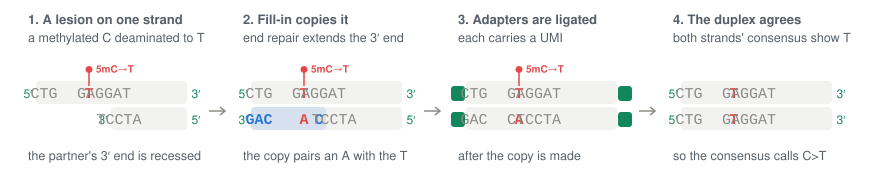
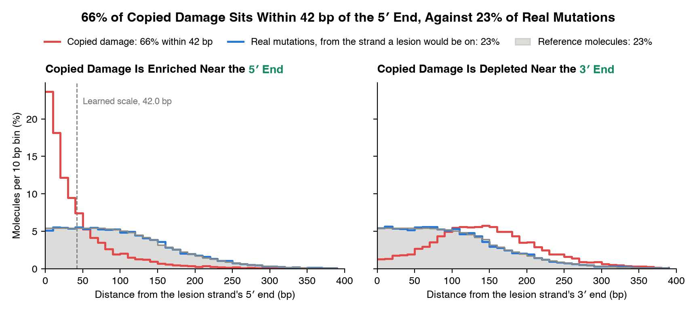
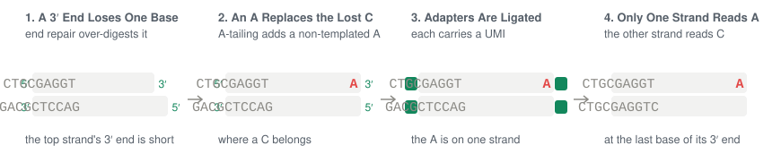
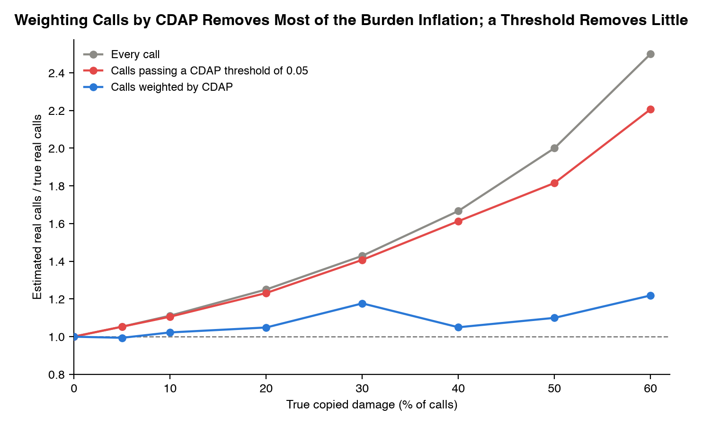

# chaff

[](http://bioconda.github.io/recipes/chaff/README.html)
[](http://bioconda.github.io/recipes/chaff/README.html)
[](https://github.com/clintval/chaff/actions/workflows/ci.yml?query=branch%3Amain)
[](https://coveralls.io/github/clintval/chaff?branch=main)
[](LICENSE)
[](https://www.rust-lang.org/)

Separate somatic variant calls from library-preparation damage artifacts.

Install with mamba, conda, or run directly with pixi:

```bash
pixi exec \
    -c conda-forge -c bioconda \
    chaff --help
```

## Quick Start

The tool `chaff` takes a VCF of somatic calls, the BAM they were called from, and the reference FASTA, which needs a `.fai`.
For a hybrid-capture Duplex Sequencing library, made with enzymatic fragmentation, a combined end repair and A-tailing step, and UMI-bearing adapters, score the calls for copied damage against the duplex consensus BAM:

```console
chaff \
    --input tests/data/calls.vcf \
    --bam tests/data/tumor.bam \
    --ref tests/data/ref.fa \
    --sample tumor \
    --filters copied-damage \
    --copied-damage-threshold 0.05 \
    --metrics tumor.chaff.tsv \
    --output calls.chaff.vcf.gz
```

The calls land in `calls.chaff.vcf.gz`, each scored call annotated in INFO and the calls likely to be copied damage filtered, and the per-sample metrics in `tumor.chaff.tsv`:

```console
gzip -dc calls.chaff.vcf.gz | grep -v '^#' | cut -f 2,4,5,7,8 | column -t
```

```text
100  C    A  CopiedDamageArtifact  CDAP=0.022;CDLR=1.577;CDAC=3,3;CDRC=72,240
200  G    A  .                     CDAP=1;CDLR=-4.55;CDAC=6,20;CDRC=72,240
300  AAA  A  .                     .
400  A    T  .                     .
500  C    G  .                     .
```

The sections below explain how damage becomes a call, what each filter scores, how to choose filters and how strictly to filter, and what each output means.

## How DNA Damage Becomes a Variant Call

A *template* is one DNA fragment as its two mates, reads or consensus, hold it, counted as one *molecule*, and its *template ends* are its outermost bases, the 5′ ends of its two strands.
A *lesion* is a damaged base on one strand that a polymerase copies as another base:

- **5-methylcytosine deaminates to thymine**, so a methylated CpG reads C>T.
- **Cytosine deaminates to uracil**, so any C can read C>T, but proofreading polymerases of the Pfu family stall at template uracil and often leave it uncopied, so most deamination that survives such a PCR is 5-methylcytosine at CpG, and copied damage learns CpG and other contexts apart.
- **Guanine oxidizes to 8-oxoguanine**, which pairs with A, so a G reads G>T, a C>A on the other strand.

Duplex Sequencing [[2]](#references) ligates UMI-bearing adapters to both ends of each fragment and keeps a base only where its two strands agree.
A duplex consensus therefore removes an error on one strand, such as a lesion left uncopied, but not damage copied onto both strands before the adapters were ligated.
End repair's polymerase does that copying before the adapters are ligated: it extends each recessed 3′ end across the 5′ overhang opposite it, and from any nick, and copies a lesion it passes onto the partner strand, so this *copied damage* reads as a real change on both strands:



## The Filters

Each filter compares where a call's alternate molecules sit on their templates with where the reference molecules sit, then writes the posterior probability that the call is real, given how common the artifact is in that sample.
A low posterior marks a likely artifact, and a threshold filters calls at or below it.
Each filter models one library-preparation step that leaves an artifact near a known end of the fragment:


The length a polymerase fills in varies from fragment to fragment, so the evidence for copied damage and end repair fill-in fades with distance from the end, by a *decay* whose *scale* the tool learns per sample, while A-tailing changes only the last base or two of a 3′ end and is scored within a 2 bp window.
All three filters run by default, but they apply no FILTER until given a threshold.
The filters score SNVs whose genotype is heterozygous, or missing as many somatic callers write it; homozygous, haploid, and indel calls pass unscored, since the filters weigh alternate molecules against the sample's reference molecules at the site.
Copied damage scores the SNVs in its damage classes on either strand: C>T covers C>T and G>A calls, and G>T covers G>T and C>A calls.
A-tailing scores those whose alternate base is A or T, and end repair fill-in all of them.

### Copied Damage


Copied damage carries its change on both strands, so the duplex consensus agrees on it, which makes this the filter for Duplex Sequencing.
Fragmenting with a restriction enzyme that leaves blunt ends, as NanoSeq does [[3]](#references), or repairing lesions before end repair, as Duplex-Repair does [[4]](#references), keeps lesions from being copied.

- **Measured from:** the 5′ end of the *lesion strand*, the strand that carries the damaged base.
- **Scored with:** a decay whose scale is learned per sample, from a default of 30 bp.
- **Writes:** the posterior `CDAP`, the likelihood ratio `CDLR`, the molecule counts `CDAC` and `CDRC`, and the FILTER `CopiedDamageArtifact`.
- **Use it when:** UMI-bearing adapters are ligated after any polymerase fills in ends, nicks, or gaps, as in Duplex Sequencing; it needs the reference, `--ref`.

As the copied damage diagram shows, the copy runs from the partner's recessed end toward the lesion strand's 5′ end, so copied lesions sit near that end, while a real mutation's molecules sit wherever the reference molecules do.
On a simulated duplex sample of 6,000 real mutations and 2,000 copied-damage calls at CpG C>T, a quarter of each with 2, 3, 5, or 10 alternate molecules, about 400 duplex molecules per site, fragments of median length 200 bp, and fill-in that copies 80% of lesions from the lesion strand's 5′ end over an exponential length with a mean of 30 bp and the rest from internal nicks anywhere in the template, the tool learns a scale of 42.0 bp, and 66% of the copied damage's alternate molecules sit within it, against 23% of the real mutations' and of the reference molecules:



Copied damage has one blind spot.
A lesion copied from an internal nick, by nick translation or strand displacement, or across the gap an abasic site leaves, can sit anywhere in the template, so its alternate molecules carry no signal of an end, and they show only as an excess of the damage class across a library.

A duplex consensus BAM that carries each strand's single-strand consensus, the `ac`, `bc`, `ad` and `bd` tags fgbio and fgumi write, covers it.
The tool then reads every molecule once more, counting its duplex changes and its *single-strand* changes, lesions on one strand that no polymerase copied, per damage class and context.
Copied lesions land on a position one molecule at a time, while a real mutation in a clone puts several molecules on one position, so the prior of a call with two or more alternate molecules becomes the share of the library's positions as deep with as many changes that chance explains.
Without those tags, the prior is learned from the calls.

### End Repair Fill-In


End repair's polymerase can misincorporate a base as it fills in a recessed 3′ end, so the error sits only on the strand it extended, near that strand's 3′ end, and a duplex consensus removes it.
Copying a lesion from the overhang instead puts the change on both strands, which is copied damage.
A call near an end can be flagged by both filters, as the call at position 100 is below; for a Duplex Sequencing library, trust copied damage, since the duplex consensus has already removed end repair's errors on one strand.

- **Measured from:** the 3′ end of the strand each template was copied from, the strand its first of pair copies: forward for an F1R2 pair and reverse for an F2R1 pair.
- **Scored with:** a decay whose scale is learned per sample, from a default of 15 bp.
- **Writes:** the posterior `ERFAP` and the FILTER `EndRepairFillInArtifact`.
- **Use it when:** a polymerase end-repaired the library before adapter ligation, as in most ligation preps after mechanical or enzymatic fragmentation, and its BAM is not a duplex consensus.

### A-Tailing



A-tailing adds a non-templated A to each 3′ end, for adapters with a T overhang to be ligated to.
Where end repair trimmed a 3′ end one base too far, that A stands in for the lost base, so copies of the strand read a T near the template's left end or, from the other strand, an A near its right end.
Only one strand carries it, so a duplex consensus mostly removes it.

- **Measured from:** the template end where the added A reads, the left end for a T and the right end for an A.
- **Scored with:** a 2 bp window, since the artifact changes only the last base or two of a 3′ end.
- **Writes:** the posterior `ATAP` and the FILTER `ATailingArtifact`.
- **Use it when:** the library was A-tailed for T-overhang adapters, unlike blunt-end ligation or transposase (tagmentation) preps, and its BAM is not a duplex consensus.

### Choosing Filters for Your Library

Every filter runs by default and only annotates calls until given a threshold, so choosing a filter means giving it a threshold.
Start from each filter's **Use it when** line, then let the data confirm the choice: give a filter a threshold when somatic calls show an excess of C>T or C>A with few supporting molecules, when their alternate bases crowd one fragment end, or when the filter's metrics, below, show a small asymmetry p-value.
Suspect copied damage in old, stored, or degraded specimens, and when C>T at CpG exceeds what the matched normal or the clock-like signature SBS1 predicts.

## Setting and Tuning

Tuning a run comes down to three steps: look at the raw reads, measure the calls, then set and check a threshold.

### 1. Look

Profile the raw reads, before consensus, with the `error` tool of [Riker](https://github.com/fulcrumgenomics/riker), as `riker error -i raw.bam -r ref.fa -o raw`, which reports the mismatch rate by cycle, by read number, and by 3 bp context.
A C>T excess rising toward read starts is deamination in single-stranded 5′ overhangs [[1]](#references), the lesions end repair copies; a C>A excess on one read number and not the other is 8-oxoguanine; and an A or T excess at read ends is A-tailing.
How far from read starts an excess reaches is a check on the decay scales the tool learns.
Damage copied onto both strands before the adapters were ligated looks the same on both strands, so no strand or read-number metric separates it from a real variant, and only the next step can see it.

### 2. Measure

Run the filters without thresholds, so they annotate the calls without filtering them, and write the metrics; each prior is learned from every scored call, whatever its FILTER, so remove heavily rejected caller output first:

```console
chaff \
    --input tests/data/calls.vcf \
    --bam tests/data/tumor.bam \
    --ref tests/data/ref.fa \
    --sample tumor \
    --output calls.annotated.vcf.gz \
    --metrics tumor.chaff.tsv
```

Each row of the metrics describes one filter and *stratum*, a group of calls that share an artifact rate: the damage class and CpG context for copied damage, and the substitution for the others.
Its columns are:

- **Calls:** `calls`, the calls scored, and `filtered`, the calls given the FILTER.
- **Fractions:** `artifact_fraction`, the stratum's learned share of artifacts, and `filter_artifact_fraction`, the filter's over all its strata, which each stratum's is drawn toward, and `expected_artifacts` and `expected_mutations`, the sums of each call's chance of being an artifact and a real mutation, a call without a posterior counting as real.
- **Distance:** `distance`, the decay scale or window in bases.
- **Molecules:** `alt_molecules` and `ref_molecules`, the molecules measured, and their `_congruent` counts and fractions, those within the distance of the artifact's end.
- **Asymmetry:** `expected_alt_congruent`, the alternate molecules each call's own reference molecules predict within the distance, and `asymmetry_p_value`, a one-sided test of whether more sit there; a small value says the library has the artifact.
- **Single strand:** for copied damage on a BAM with single-strand consensus, `change_rate` and `single_strand_rate`, the duplex and single-strand changes of the class per molecule, their `conversion_ratio`, `chance_fraction`, the mean prior of its calls, and `chance_excess`, the positions with two or more changes that chance expects beyond those seen, as a share of them.

```console
cut -f 2,3,6,8,18 tumor.chaff.tsv | column -t
```

```text
filter              stratum      artifact_fraction  distance  asymmetry_p_value
copied-damage       C>T:non-CpG  0.44854            23.0591   0.589947
copied-damage       G>T:CpG      0.537421           23.0591   0.0274487
a-tailing           C>A          0.19272            2.0       0.00246167
a-tailing           C>T          0.189318           2.0       1.0
a-tailing           T>A          0.189332           2.0       0.000231639
end-repair-fill-in  C>A          0.391688           12.1865   0.00451579
end-repair-fill-in  C>G          0.301492           12.1865   1.0
end-repair-fill-in  C>T          0.301492           12.1865   0.665409
end-repair-fill-in  T>A          0.301492           12.1865   1.0
```

With one call per stratum, each stratum's fraction stays near its filter's, learned from only 2 to 4 calls, so the fractions say little here; the p-values carry the signal, small for copied damage's G>T:CpG, A-tailing's C>A and T>A, and end repair fill-in's C>A.
The scales, 23.1 bp from 2 copied-damage calls and 12.2 bp from 4 end repair calls, sit between the alternate molecules' 3 bp and the defaults of 30 and 15 bp.
The counts behind a p-value are in the row:

```console
grep -e ^sample -e a-tailing tumor.chaff.tsv | cut -f 3,11,12,13,18 | column -t
```

```text
stratum  alt_molecules  alt_congruent  expected_alt_congruent  asymmetry_p_value
C>A      3              2              0.0867769               0.00246167
C>T      20             0              0.578512                1.0
T>A      5              3              0.144628                0.000231639
```

Three of the 5 alternate molecules of the A>T at position 400 sit where A-tailing puts them, against 0.14 expected, yet the other 2 cannot be A-tailing, so the call is spared: the p-value asks whether a library has the artifact, and the posterior whether one call is it.

### 3. Set and Check

A threshold of 0.05 filters the calls with at most a 5% chance of being real.
Here each filter applies its FILTER at 0.05, and the output is BGZF-compressed by its extension:

```console
chaff \
    --input tests/data/calls.vcf \
    --bam tests/data/tumor.bam \
    --ref tests/data/ref.fa \
    --sample tumor \
    --output calls.chaff.vcf.gz \
    --copied-damage-threshold 0.05 \
    --end-repair-fill-in-threshold 0.05 \
    --a-tailing-threshold 0.05
gzip -dc calls.chaff.vcf.gz | grep -v '^#' | cut -f 2,4,5,7 | column -t
```

```text
100  C    A  CopiedDamageArtifact;EndRepairFillInArtifact
200  G    A  .
300  AAA  A  .
400  A    T  .
500  C    G  .
```

The call at position 100 is filtered as copied damage and end repair fill-in.
The calls at positions 400 and 500 pass: their alternate molecules sit at the 5′ end of the strand each template was copied from, where end repair adds no bases, and 2 of the A>T's 5 alternate molecules sit where A-tailing cannot put them.
The deletion at position 300 is not scored.

To check a threshold, run `chaff` a second time on the somatic VCF merged with a few germline heterozygous SNVs of the same sample, in sorted order as by `bcftools concat -a` and marked by their ID, far fewer than the somatic calls so they barely move the learned prior.
Germline calls are real, so the share of those with 2 to 10 alternate molecules that this run filters estimates how often real somatic calls are filtered in the run without them.
Where a matched normal or a replicate library exists, the somatic calls it shares are a second check.

On the simulated sample of the copied damage section, a threshold of 0.05 filters 821 of the 2,000 copied-damage calls and 9 of the 1,065 real C>T at CpG, and none of the 4,935 calls in other channels: 73% of the copied damage with 10 alternate molecules, 50% with 5, 34% with 3, and only 6% with 2.
In the figure, each curve sweeps the threshold, counting real calls filtered among the real C>T at CpG, the stratum copied damage shares, and the filled dots mark a threshold of 0.05; the open circles show `--model fgbio`, which uses fgbio's per-call prior from the alternate allele fraction: at the same threshold it filters 1,955 of the copied-damage calls, but also 94%, 75%, 49%, and 11% of the real C>T at CpG with 2, 3, 5, and 10 alternate molecules, against at most 1.6% under the `chaff` model:


At 2 alternate molecules a threshold catches only a minority of copied damage, so for a mutation burden or frequency, weight each call by its `CDAP`, as the `expected_mutations` column of the metrics does, instead of filtering.
On simulated libraries of 400 C>T calls at CpG, most with 2 to 4 alternate molecules, weighting brings a 2.5-fold overcount at 60% damage down to 1.2-fold, where a threshold of 0.05 leaves 2.2-fold:



Weighting reduces the overcount but cannot remove it where calls rest on 2 molecules and the end signal is weak: there the learned artifact fraction understates damage, 51% for a true 60% here, and the posteriors lean toward real, as they can more on real data.
The learned artifact fraction and the asymmetry p-value still rank samples by damage, which makes them a good per-sample covariate:


## What `chaff` Writes

Each filter writes its posteriors and counts into the INFO of the calls it scores, and its FILTER onto the calls at or below its threshold:

| Name&nbsp;&nbsp;&nbsp;&nbsp;&nbsp;&nbsp;&nbsp;&nbsp;&nbsp;&nbsp;&nbsp;&nbsp;&nbsp;&nbsp;&nbsp;&nbsp;&nbsp;&nbsp;&nbsp;&nbsp;&nbsp;&nbsp;&nbsp;&nbsp;&nbsp;&nbsp;&nbsp;&nbsp;&nbsp;&nbsp;&nbsp;&nbsp;&nbsp;&nbsp;&nbsp;&nbsp;&nbsp;&nbsp;&nbsp;&nbsp;&nbsp;&nbsp;&nbsp;&nbsp;&nbsp;&nbsp; | Stands for | Meaning |
| --- | --- | --- |
| `CDAP` | Copied Damage Artifact Posterior | The posterior probability that the call is a real mutation rather than damage copied onto both strands; a low value means likely copied damage. |
| `CDLR` | Copied Damage Likelihood Ratio | The log10 likelihood ratio of copied damage to a real mutation; a high value favors copied damage. |
| `CDAC` | Copied Damage Alternate Counts | The alternate molecules within the decay scale of the lesion strand's 5′ end, and all alternate molecules measured. |
| `CDRC` | Copied Damage Reference Counts | The same two counts for the reference molecules. |
| `ERFAP` | End Repair Fill-in Artifact Posterior | The posterior probability that the call is a real mutation rather than an end repair fill-in error; a low value means a likely error. |
| `ATAP` | A-Tailing Artifact Posterior | The posterior probability that the call is a real mutation rather than an A-tailing artifact; a low value means a likely artifact. |
| `CopiedDamageArtifact` | A FILTER | Applied where `CDAP` is at or below the copied damage threshold. |
| `EndRepairFillInArtifact` | A FILTER | Applied where `ERFAP` is at or below the end repair fill-in threshold. |
| `ATailingArtifact` | A FILTER | Applied where `ATAP` is at or below the A-tailing threshold. |

The call at position 100 in the quick start is a C>A, which copied damage reads as a G>T lesion, an oxidized G, on the reverse strand.
Its `CDAP` of 0.022, at or below the threshold of 0.05, puts the FILTER on it, and its `CDAC` of 3,3 and `CDRC` of 72,240 say that all 3 of its alternate molecules sit within the learned scale of the lesion strand's 5′ end, where 72 of its 240 reference molecules do.
The tool learns per sample how common each artifact is and how far it reaches, so most runs need only the filters and a threshold, and the model behind the posteriors is described in the crate documentation, in [`src/lib/mod.rs`](src/lib/mod.rs).

## Options

| Option&nbsp;&nbsp;&nbsp;&nbsp;&nbsp;&nbsp;&nbsp;&nbsp;&nbsp;&nbsp;&nbsp;&nbsp;&nbsp;&nbsp;&nbsp;&nbsp;&nbsp;&nbsp;&nbsp;&nbsp;&nbsp;&nbsp;&nbsp;&nbsp;&nbsp;&nbsp;&nbsp;&nbsp;&nbsp;&nbsp;&nbsp;&nbsp;&nbsp;&nbsp;&nbsp;&nbsp;&nbsp;&nbsp;&nbsp;&nbsp;&nbsp;&nbsp;&nbsp;&nbsp;&nbsp;&nbsp;&nbsp;&nbsp;&nbsp;&nbsp;&nbsp;&nbsp;&nbsp;&nbsp;&nbsp;&nbsp;&nbsp;&nbsp;&nbsp;&nbsp;&nbsp;&nbsp; | Sets |
| --- | --- |
| `--input` | The coordinate-sorted VCF or BCF of somatic calls (short `-i`; required). |
| `--output` | The output VCF or BCF, its format set by its extension: `.vcf`, `.vcf.gz`, `.bcf`, or `-` for standard output (short `-o`; required). |
| `--bam` | The coordinate-sorted BAM of the sample, reads or consensus (short `-b`; required). |
| `--ref` | The reference FASTA, with its `.fai`, which copied damage and `--spectrum` need (short `-r`). |
| `--sample` | The sample the BAM holds, required when the VCF has more than one (short `-s`). |
| `--metrics` | The per-sample metrics TSV, one row per filter and stratum (default none). |
| `--spectrum` | A PDF of the sample's heterozygous SNVs, whatever their FILTER, by trinucleotide context on one scale: every SNV, the expected real SNVs, each weighted by the product of the posteriors of the filters `--filters` enables, and, with a threshold, the passing SNVs (default none). |
| `--filters` | The filters to run (default all three). |
| `--model` | The model, either `chaff`, which learns each sample's artifact fractions and decay scales, or `fgbio`, which uses fgbio's per-call prior and windows to reproduce its values (default `chaff`). |
| `--copied-damage-threshold` | The posterior at or below which copied damage applies its FILTER (default none). |
| `--end-repair-fill-in-threshold` | The posterior at or below which end repair fill-in applies its FILTER (default none). |
| `--a-tailing-threshold` | The posterior at or below which A-tailing applies its FILTER (default none). |
| `--copied-damage-classes` | The damage classes, damaged base `>` read base: `C>T` for deamination from heat, storage, or formalin, and `G>T` for oxidation from shearing or heat (default `C>T,G>T`). |
| `--copied-damage-distance` | The decay scale in bases from the lesion strand's 5′ end, the mean length over which a polymerase copies a lesion strand onto its partner, or `learned` (default `learned`). |
| `--end-repair-fill-in-distance` | The decay scale in bases from the 3′ end of the strand each template was copied from, or `learned` (default `learned`); under `--model fgbio`, the window from the nearest template end (default 15). |
| `--a-tailing-distance` | The window from the template end, in bases (default 2). |
| `--min-mapping-quality` | The mapping quality floor of a read or consensus (short `-m`; default 20). |
| `--min-base-quality` | The base quality floor at the call (short `-q`; default 20). |
| `--paired-reads-only` | Keep only reads or consensus whose mate is mapped (short `-p`; default off). |

The VCF/BCF and the BAM must be coordinate sorted, with their contigs in the same order, and need no index; the FASTA needs a `.fai`.
Each template counts once, and a read or consensus whose mate maps to the same contig needs the mate's CIGAR in its `MC` tag.
Both ends of a template are measured for an FR pair, whose forward mate starts at or before its reverse mate's 5′ end; a mate of any other pair knows only its own end.
An option of a filter that `--filters` leaves out is a usage error, and so is `--ref` without `copied-damage` or `--spectrum`.
A VCF that already declares an enabled filter's INFO or FILTER, from an earlier run, is refused, so a FILTER never outlives the run that applied it; remove them first, as with `bcftools annotate -x`.

## Development and Testing

See the [contributing guide](./CONTRIBUTING.md) for more information.
For compatibility with fgbio's `FilterSomaticVcf`, whose end repair fill-in and A-tailing filters `chaff` ports, those two filters write its INFO keys and FILTER names, `--model fgbio` reproduces its values, and the README examples run on its test data.

## References

The tool `chaff` ports the end repair fill-in and A-tailing filters of fgbio's `FilterSomaticVcf`, with their likelihoods and tests, adds copied damage, and builds on these papers and tools:

1. Briggs AW, et al. 2007. Patterns of damage in genomic DNA sequences from a Neandertal. *Proceedings of the National Academy of Sciences* 104(37):14616–14621. [https://doi.org/10.1073/pnas.0704665104](https://doi.org/10.1073/pnas.0704665104)
2. Schmitt MW, et al. 2012. Detection of ultra-rare mutations by next-generation sequencing. *Proceedings of the National Academy of Sciences* 109(36):14508–14513. [https://doi.org/10.1073/pnas.1208715109](https://doi.org/10.1073/pnas.1208715109)
3. Abascal F, et al. 2021. Somatic mutation landscapes at single-molecule resolution. *Nature* 593(7859):405–410. [https://doi.org/10.1038/s41586-021-03477-4](https://doi.org/10.1038/s41586-021-03477-4)
4. Xiong K, et al. 2022. Duplex-Repair enables highly accurate sequencing, despite DNA damage. *Nucleic Acids Research* 50(1):e1. [https://doi.org/10.1093/nar/gkab855](https://doi.org/10.1093/nar/gkab855)
5. GATK's `LearnReadOrientationModel`: [https://gatk.broadinstitute.org/hc/en-us/articles/360057439111-LearnReadOrientationModel](https://gatk.broadinstitute.org/hc/en-us/articles/360057439111-LearnReadOrientationModel)
6. fgbio's `FilterSomaticVcf`: [https://fulcrumgenomics.github.io/fgbio/tools/latest/FilterSomaticVcf.html](https://fulcrumgenomics.github.io/fgbio/tools/latest/FilterSomaticVcf.html), from [https://github.com/fulcrumgenomics/fgbio](https://github.com/fulcrumgenomics/fgbio)
