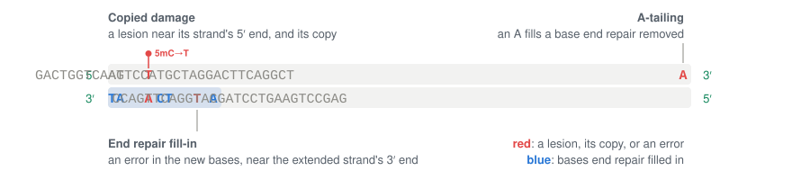

# chaff

[](https://github.com/clintval/chaff/actions/workflows/ci.yml?query=branch%3Amain)
[](https://coveralls.io/github/clintval/chaff?branch=main)
[](LICENSE)
[](https://www.rust-lang.org/)

Separate somatic variant calls from library-preparation damage artifacts.

## Installation

```console
cargo install --git https://github.com/clintval/chaff
```

## How Damage Becomes a Call

A DNA fragment is two complementary strands, each running 5′ to 3′.
Its *template ends* are its outermost bases, the 5′ ends of its two strands, and its *template* is the fragment as a read pair sees it.

A *lesion* is a damaged base on one strand that a polymerase copies as another base:

- 5-methylcytosine deaminates to thymine, so a methylated CpG reads C>T.
- Cytosine deaminates to uracil, so any C can read C>T, but proofreading polymerases of the Pfu family stall at template uracil and often leave it uncopied.
- Guanine oxidizes to 8-oxoguanine, which pairs with A, so a G reads G>T, a C>A on the other strand.

Duplex Sequencing tags both strands of a fragment with a UMI and keeps a base only where the two strands agree, so a lesion on one strand is outvoted by its partner.
End repair can defeat that.
Fragmentation leaves single-stranded overhangs, and end repair's polymerase extends each recessed 3′ end across the 5′ overhang opposite it, and from any nick, copying a lesion into the partner before the UMIs and adapters go on:


Both strands now read T at the lesion, so the duplex consensus agrees on a C>T that looks real.
The polymerase copies from the partner's recessed end toward the lesion strand's 5′ end, so copied lesions sit near the 5′ end of the strand that carries them and rarely near its 3′ end, while a true mutation's molecules sit wherever the reference molecules at the site do.
This is *copied damage*.
On a simulated duplex sample of 6,000 real mutations and 2,000 copied-damage calls at CpG C>T, with about 400 duplex molecules per site, fragments of median length 200 bp, and fill-in that copies the lesion strand from its 5′ end over an exponential length with a mean of 30 bp, chaff learns a scale of 30.3 bp, and 65% of the copied damage's alternate molecules sit within it, against 17% of the real mutations' and of the reference molecules:


Copied damage has one blind spot.
A lesion copied from an internal nick, by nick translation or strand displacement, or across the gap an abasic site leaves, can sit anywhere in the template, so its alternate molecules carry no signal of an end: no per-call score can separate them from a real mutation's, and they show only as an excess of the damage class across a library.

The other two artifacts sit on one strand.
A base that end repair's polymerase misincorporates lies on the strand it extended, near that strand's 3′ end.
A-tailing then adds a non-templated A to each 3′ end, for adapters with a T overhang to ligate to.
Where end repair over-digested a 3′ end, that A stands in for a lost base, so copies of the strand begin with a T where another base belongs: a T near the template's left end or, from the other strand, an A near its right end.
One fragment shows where each artifact sits, with the lesion and its copy, a misincorporated base, and an added A in red, and the bases end repair filled in in blue:



A duplex consensus outvotes an error on one strand, so copied damage is the filter for Duplex Sequencing, and end repair fill-in and A-tailing matter for single-strand consensus and for libraries without UMIs.

Each chaff filter models one of these steps and writes its posterior probability that a call is a true mutation, applying its FILTER at or below a threshold you set:

| Filter&nbsp;&nbsp;&nbsp;&nbsp;&nbsp;&nbsp;&nbsp;&nbsp;&nbsp;&nbsp;&nbsp;&nbsp;&nbsp;&nbsp;&nbsp;&nbsp;&nbsp;&nbsp;&nbsp;&nbsp;&nbsp;&nbsp;&nbsp;&nbsp;&nbsp;&nbsp;&nbsp;&nbsp;&nbsp;&nbsp;&nbsp;&nbsp;&nbsp;&nbsp;&nbsp;&nbsp; | Models | INFO | FILTER |
| --- | --- | --- | --- |
| `copied-damage` | Lesions copied onto the partner strand | `CDAP`, `CDLR`, `CDAC`, `CDRC` | `CopiedDamageArtifact` |
| `end-repair-fill-in` | Errors on the strand end repair extends | `ERFAP` | `EndRepairFillInArtifact` |
| `a-tailing` | An A added to an over-digested 3′ end | `ATAP` | `ATailingArtifact` |

Each filter scores heterozygous SNVs: copied damage those in its damage classes, `C>T` and `G>T` by default, A-tailing those to A or T, and end repair fill-in all of them.

Each filter also weighs how far a call's molecules sit from the end its artifact favors, out to its *distance*:

| Filter&nbsp;&nbsp;&nbsp;&nbsp;&nbsp;&nbsp;&nbsp;&nbsp;&nbsp;&nbsp;&nbsp;&nbsp;&nbsp;&nbsp;&nbsp;&nbsp;&nbsp;&nbsp;&nbsp;&nbsp;&nbsp;&nbsp;&nbsp;&nbsp;&nbsp;&nbsp;&nbsp;&nbsp;&nbsp;&nbsp;&nbsp;&nbsp;&nbsp;&nbsp;&nbsp;&nbsp; | Distance from | Model chaff | Model fgbio |
| --- | --- | --- | --- |
| `copied-damage` | The lesion strand's 5′ end | A decay with a learned scale | The same decay |
| `end-repair-fill-in` | The 3′ end of the strand each template was copied from | A decay with a learned scale | A 15 bp window from either end |
| `a-tailing` | The end where an added A reads | A 2 bp window | The same window |

A polymerase fills an overhang or copies a lesion over a length that varies from fragment to fragment, so the evidence for copied damage and end repair fill-in fades with distance, as `w(d) = exp(-d / s)`, with no cliff at any one distance.
chaff learns the scale `s` from each library's calls, shrunk toward 30 bp for copied damage and 15 bp for end repair fill-in by 10 pseudo-calls, unless you fix it.
A-tailing changes only the last base or two of a 3′ end, so a window is its shape.

The strand a template was copied from is the strand of its read 1, which copies that strand from its 5′ end: an F1R2 pair comes from the forward strand and an F2R1 pair from the reverse, as GATK's `LearnReadOrientationModel` reads them.
A duplex consensus, whose reads carry fgbio's `aD` and `bD` depths of both strands, holds both, so end repair fill-in measures it from its nearer end.

## Which Filters to Use

All three filters run by default, but their thresholds default to none, so a filter annotates calls and applies no FILTER until you give it a threshold.
Keep the filters your library preparation has:

| Filter&nbsp;&nbsp;&nbsp;&nbsp;&nbsp;&nbsp;&nbsp;&nbsp;&nbsp;&nbsp;&nbsp;&nbsp;&nbsp;&nbsp;&nbsp;&nbsp;&nbsp;&nbsp;&nbsp;&nbsp;&nbsp;&nbsp;&nbsp;&nbsp;&nbsp;&nbsp;&nbsp;&nbsp;&nbsp;&nbsp;&nbsp;&nbsp;&nbsp;&nbsp;&nbsp;&nbsp; | Keep it when the library |
| --- | --- |
| `copied-damage` | Carries UMIs or duplex tags added after any polymerase fills ends, nicks, or gaps, as Duplex Sequencing does; check your prep's order of steps |
| `end-repair-fill-in` | Was end-repaired by a polymerase before adapter ligation, as most ligation preps after mechanical or enzymatic fragmentation are, and is read without a duplex consensus |
| `a-tailing` | Was A-tailed for T-overhang adapters, unlike blunt-end ligation or transposase (tagmentation) preps, and is read without a duplex consensus |

The copied damage filter needs the reference FASTA, `--ref`, for CpG context, and paired reads, whose template ends it measures.

The data say to keep a filter when somatic calls show an excess of C>T or C>A with few supporting molecules, when their alternate bases crowd one fragment end, or when the filter's metrics, below, learn an artifact fraction well above zero.
Suspect copied damage in old, stored, or degraded specimens, and when C>T calls crowd CpGs.

## Setting and Tuning

Most runs need only the filters and a threshold, since the prior and the decay scales are learned per sample.

### 1. Look

Profile the raw reads, before consensus, with the `error` tool of [Riker](https://github.com/fulcrumgenomics/riker), as `riker error -i raw.bam -r ref.fa -o raw`, whose default strata report the mismatch rate by cycle, by read number, and by 3 bp context.
A C>T or G>A excess rising toward read starts points to end repair fill-in, a C>A excess on one read number and not the other to 8-oxoguanine, and an A or T excess at read ends to A-tailing.
How far from read starts an excess reaches is a check on the decay scales chaff learns.
Damage copied onto both strands before the UMIs went on reads as a real base to every read-level metric, so only the next step can see it.

### 2. Measure

Run the filters without thresholds, so chaff annotates calls without filtering them, and write the metrics:

```console
chaff \
    --input tests/data/calls.vcf \
    --bam tests/data/tumor.bam \
    --ref tests/data/ref.fa \
    --sample tumor \
    --output calls.annotated.vcf.gz \
    --metrics tumor.chaff.tsv
```

The metrics have one row per filter and *stratum*, the subset of calls a prior is learned in: the damage class and CpG context for `copied-damage`, and the substitution for the others.
Each row's *artifact fraction* is the share of its calls that are artifacts, learned from the calls themselves, its *distance* is the filter's decay scale or window in bases, and its asymmetry p-value tests whether more alternate molecules sit within that distance of the artifact's end than each call's own reference molecules predict:

```console
cut -f 2,3,6,8,17 tumor.chaff.tsv | column -t
```

```text
filter              stratum      artifact_fraction  distance  asymmetry_p_value
copied-damage       C>T:non-CpG  0.448724           22.7678   0.72908
copied-damage       G>T:CpG      0.53767            22.7678   0.0242018
a-tailing           C>A          0.19272            2.0       0.00246167
a-tailing           C>T          0.189318           2.0       1.0
a-tailing           T>A          0.189332           2.0       0.000231639
end-repair-fill-in  C>A          0.391718           12.1245   0.00451579
end-repair-fill-in  C>G          0.301512           12.1245   1.0
end-repair-fill-in  C>T          0.301512           12.1245   0.665409
end-repair-fill-in  T>A          0.301512           12.1245   1.0
```

Every filter learns a fraction well above zero on these calls, which were built to carry A-tailing and end repair artifacts, so all three stay on; across many calls, a fraction near zero says a library lacks that artifact.
The decays learn scales of 22.8 and 12.1 bp: the alternate molecules here sit within 3 bp of an end, but 2 and 4 calls move a scale only part of the way from its default.
The counts behind a p-value are in the row:

```console
grep -e ^sample -e a-tailing tumor.chaff.tsv | cut -f 3,10,11,12,17 | column -t
```

```text
stratum  alt_molecules  alt_congruent  expected_alt_congruent  asymmetry_p_value
C>A      3              2              0.0867769               0.00246167
C>T      20             0              0.578512                1.0
T>A      5              3              0.144628                0.000231639
```

Three of the 5 alternate molecules of the A>T at position 400 sit where A-tailing puts them, against 0.14 expected, yet the other 2 cannot be A-tailing, so the call is spared: the p-value asks whether a library has the artifact, and the posterior whether one call is it.

### 3. Set and Check

A posterior is the probability that a call is a true mutation, given its molecules and the prior, so a threshold of 0.05 filters the calls with at most a 5% chance of being real.
Here each filter applies its FILTER at 0.05, and the output is BGZF-compressed by its extension:

```console
chaff \
    --input tests/data/calls.vcf \
    --bam tests/data/tumor.bam \
    --ref tests/data/ref.fa \
    --sample tumor \
    --output calls.chaff.vcf.gz \
    --copied-damage-threshold 0.05 \
    --end-repair-fill-in-threshold 0.05 \
    --a-tailing-threshold 0.05
gzip -dc calls.chaff.vcf.gz | grep -v '^#' | cut -f 2,4,5,7 | column -t
```

```text
100  C    A  CopiedDamageArtifact;EndRepairFillInArtifact
200  G    A  .
300  AAA  A  .
400  A    T  .
500  C    G  .
```

The posteriors behind those FILTERs are in the INFO of either run:

```console
gzip -dc calls.chaff.vcf.gz | grep -v '^#' | cut -f 2,4,5,8 | column -t
```

```text
100  C    A    CDAP=0.022;CDLR=1.591;CDAC=3,3;CDRC=69,240;ATAP=0.963;ERFAP=0.007738
200  G    A    CDAP=1;CDLR=-4.652;CDAC=5,20;CDRC=69,240;ATAP=1;ERFAP=1
300  AAA  A    .
400  A    T    ATAP=1;ERFAP=1
500  C    G    ERFAP=1
```

The `CDAP`, `ATAP`, and `ERFAP` fields are the posteriors, `CDLR` is the log10 likelihood ratio of copied damage to a true mutation, and `CDAC` and `CDRC` count the alternate and reference molecules within the learned distance of the lesion strand's 5′ end, out of all measured.
All 3 alternate molecules of the C>A at position 100 sit within it, where 69 of the 240 reference molecules do, while 5 of the 20 alternate molecules of the G>A at position 200 do.
The deletion at position 300 is not scored.

To check a threshold, run chaff on germline heterozygous calls from the same reads: they are real, so the share it filters estimates how often it filters real somatic calls.
Where a matched normal or a replicate library exists, the somatic calls it shares are a second check.

The prior is the chance that a call is an artifact before its molecules are seen, and the model sets it:

- Under `--model chaff`, the default, each filter learns its artifact fraction `π_f` from all its calls, `π_f = (Σ r_i + 1) / (n + 2)` with `r_i = σ(LLR_i + logit π_f)`, along with its decay scale, and each stratum then learns `π = (Σ r_i + 10 π_f) / (n + 10)` from its own calls and 10 pseudo-calls at `π_f`, so a stratum of one or two calls mostly inherits `π_f`. A threshold then weighs each call against its own library's artifact rate and means much the same across samples.
- Under `--model fgbio`, chaff reproduces fgbio's `FilterSomaticVcf`: a mutation prior of `min((2 * maf)^2, 0.9999)` from each call's alternate molecule fraction, which presumes every low-fraction call an artifact whatever the library, and windows from either template end.

The same calls under each model's end repair fill-in, fgbio's in the first three columns and chaff's in the last two:

```console
for model in fgbio chaff; do
    chaff \
        --input tests/data/calls.vcf \
        --bam tests/data/tumor.bam \
        --sample tumor \
        --output $model.vcf \
        --filters end-repair-fill-in \
        --end-repair-fill-in-threshold 0.05 \
        --model $model
done
paste fgbio.vcf chaff.vcf | grep -v '^#' | cut -f 2,7,8,18,19 | column -t
```

```text
100  EndRepairFillInArtifact  ERFAP=0.00003218  EndRepairFillInArtifact  ERFAP=0.007738
200  .                        ERFAP=1           .                        ERFAP=1
300  .                        .                 .                        .
400  EndRepairFillInArtifact  ERFAP=0.00001239  .                        ERFAP=1
500  EndRepairFillInArtifact  ERFAP=0.00001239  .                        ERFAP=1
```

fgbio's window filters the calls at positions 100, 400, and 500, whose 3 to 5 alternate molecules sit within 3 bp of a template end.
The calls at positions 400 and 500 are flagged only under `--model fgbio` because fgbio's test data puts their alternate molecules at the 5′ end of the strand each template was copied from, where end repair adds no bases.

On the simulated sample above, with a quarter of each kind of call at 2, 3, 5, or 10 alternate molecules, the chaff model at a threshold of 0.05 filters 1,427 of the 2,000 copied-damage calls and 23 of the 1,065 real C>T at CpG, and none of the 4,935 calls in other channels.
It filters 95% of the copied damage with 10 alternate molecules and 86% with 5, but only 40% with 2, where it also filters 6 of 253 real C>T at CpG.
The fgbio model filters all but 2 of the 2,000 copied-damage calls, and with them 82% of the real C>T at CpG with 2 alternate molecules and 5.4% with 10:


With `--model fgbio`, chaff writes fgbio 4.1.1's values and FILTERs wherever overlapping mates agree in base and quality, no read has an indel or soft clip between the call and its mate's 5′ end, and every base is Q2 or better, as on this data.
Where chaff differs from fgbio on purpose is listed in the crate documentation, in [`src/lib/mod.rs`](src/lib/mod.rs).

## Options

| Option&nbsp;&nbsp;&nbsp;&nbsp;&nbsp;&nbsp;&nbsp;&nbsp;&nbsp;&nbsp;&nbsp;&nbsp;&nbsp;&nbsp;&nbsp;&nbsp;&nbsp;&nbsp;&nbsp;&nbsp;&nbsp;&nbsp;&nbsp;&nbsp;&nbsp;&nbsp;&nbsp;&nbsp;&nbsp;&nbsp;&nbsp;&nbsp;&nbsp;&nbsp;&nbsp;&nbsp;&nbsp;&nbsp;&nbsp;&nbsp;&nbsp;&nbsp;&nbsp;&nbsp;&nbsp;&nbsp;&nbsp;&nbsp;&nbsp;&nbsp;&nbsp;&nbsp;&nbsp;&nbsp;&nbsp;&nbsp;&nbsp;&nbsp;&nbsp;&nbsp;&nbsp;&nbsp; | Sets |
| --- | --- |
| `--filters` | The filters to run (default all three). |
| `--model` | The model, `chaff` or `fgbio` (default `chaff`). |
| `--copied-damage-threshold` | The posterior at or below which copied damage applies its FILTER (default none). |
| `--end-repair-fill-in-threshold` | The posterior at or below which end repair fill-in applies its FILTER (default none). |
| `--a-tailing-threshold` | The posterior at or below which A-tailing applies its FILTER (default none). |
| `--copied-damage-classes` | The damage classes, damaged base `>` read base: `C>T` for deamination from heat, storage, or formalin, and `G>T` for oxidation from shearing or heat (default `C>T,G>T`). |
| `--copied-damage-distance` | The decay scale in bases from the lesion strand's 5′ end, the mean length a polymerase copies a lesion strand over, or `learned` (default `learned`). |
| `--end-repair-fill-in-distance` | The decay scale in bases from the 3′ end of the strand each template was copied from, or `learned`; under the fgbio model, the window in bases from either template end (default `learned`, or 15 under the fgbio model). |
| `--a-tailing-distance` | The window from the template end, in bases (default 2). |
| `--min-mapping-quality` | The mapping quality floor of a read (default 20). |
| `--min-base-quality` | The base quality floor at the call (default 20). |
| `--paired-reads-only` | Keep only reads whose mate is mapped (default off). |

The VCF/BCF and the BAM must be coordinate sorted, and neither needs an index.
Each template counts once, and a read whose mate maps to the same contig needs the mate's CIGAR in its `MC` tag.
Both ends of a template are measured for an FR pair, whose forward read starts at or before its reverse read's 5′ end; a read of any other pair knows only its own end.
An option of a filter that `--filters` leaves out is a usage error, and so is `--ref` without `copied-damage`.
A VCF that already declares an enabled filter's INFO or FILTER, from an earlier run of chaff or fgbio, is refused, so a FILTER never outlives the run that applied it; remove them first, as with `bcftools annotate -x`.

## Likelihoods

- Copied damage, and end repair fill-in under the chaff model: a copy reaches distance `d` from its end with probability `w(d) = exp(-d / s)`, so `LLR = Σ ln((1 - e) w(d) / W + e)` over the alternate molecules, with `W` the mean `w(d)` of the reference molecules and `e` the base error. The scale `s` is one per filter, shared by its strata, and is the scale `s_mle` that maximizes the filter's marginal likelihood, with `π_f` solved exactly at each scale, shrunk toward the default `s_0`, 30 bp for copied damage and 15 bp for end repair fill-in, as `ln s = (Σ r_i ln s_mle + 10 ln s_0) / (Σ r_i + 10)`: only artifact calls carry a scale, so their expected count `Σ r_i` weighs the data against 10 pseudo-calls at the default. A call without both a measured reference and a measured alternate molecule gets no posterior.
- A-tailing, and end repair fill-in under the fgbio model: fgbio's windowed likelihoods, which compare the alternate molecules inside the window with the share of reference molecules there.

The examples run on fgbio's `FilterSomaticVcf` test data in [`tests/data`](tests/data): five tumor/normal calls on `chr1` at positions 100 to 500 in `calls.vcf`, the tumor's reads in `tumor.bam`, with alternate molecules near a template end at positions 100, 400, and 500, and the reference in `ref.fa`.

## Development and Testing

See the [contributing guide](./CONTRIBUTING.md) for more information.

## References

chaff ports the filters, likelihoods, and tests of fgbio's `FilterSomaticVcf`, and builds on these papers and tools:

- Briggs AW, et al. 2007. Patterns of damage in genomic DNA sequences from a Neandertal. *Proceedings of the National Academy of Sciences* 104(37):14616–14621. [https://doi.org/10.1073/pnas.0704665104](https://doi.org/10.1073/pnas.0704665104)
- Schmitt MW, et al. 2012. Detection of ultra-rare mutations by next-generation sequencing. *Proceedings of the National Academy of Sciences* 109(36):14508–14513. [https://doi.org/10.1073/pnas.1208715109](https://doi.org/10.1073/pnas.1208715109)
- Abascal F, et al. 2021. Somatic mutation landscapes at single-molecule resolution. *Nature* 593(7859):405–410. [https://doi.org/10.1038/s41586-021-03477-4](https://doi.org/10.1038/s41586-021-03477-4)
- Xiong K, et al. 2022. Duplex-Repair enables highly accurate sequencing, despite DNA damage. *Nucleic Acids Research* 50(1):e1. [https://doi.org/10.1093/nar/gkab855](https://doi.org/10.1093/nar/gkab855)
- GATK's `LearnReadOrientationModel`: [https://gatk.broadinstitute.org/hc/en-us/articles/360057439111-LearnReadOrientationModel](https://gatk.broadinstitute.org/hc/en-us/articles/360057439111-LearnReadOrientationModel)
- fgbio's `FilterSomaticVcf`: [https://fulcrumgenomics.github.io/fgbio/tools/latest/FilterSomaticVcf.html](https://fulcrumgenomics.github.io/fgbio/tools/latest/FilterSomaticVcf.html), from [https://github.com/fulcrumgenomics/fgbio](https://github.com/fulcrumgenomics/fgbio)
